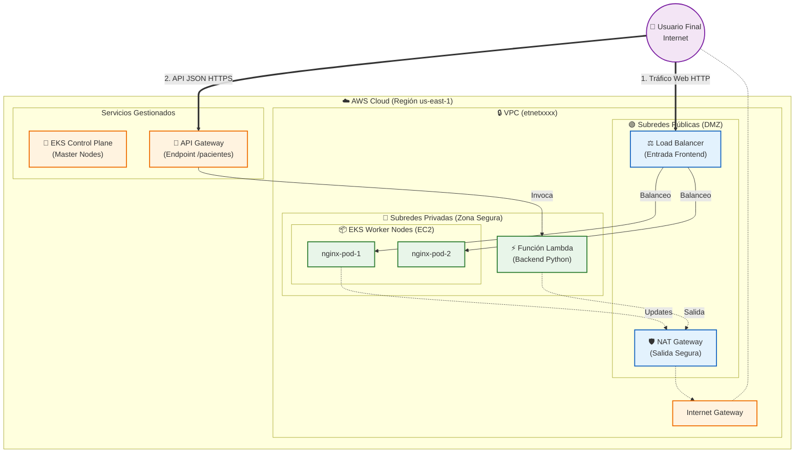

# 🏥 Infraestructura Hospital SanaVI - Cloud Project

Este proyecto despliega una arquitectura híbrida en AWS utilizando **Terraform**, **Kubernetes (EKS)** y **Serverless (Lambda)**.

## 🏗️ Arquitectura Desplegada

La solución implementa una VPC con segregación de redes (Pública/Privada) para garantizar la seguridad de los datos de los pacientes.

## 🛠️ Tecnologías Utilizadas##
IaC: Terraform

Orquestación: Amazon EKS (Kubernetes)

Backend: AWS Lambda (Python) & API Gateway

Seguridad: RBAC, Network Policies (Calico), IAM Roles

## 👥 Autores
Bryan Painemilla

Juan Crovetto
